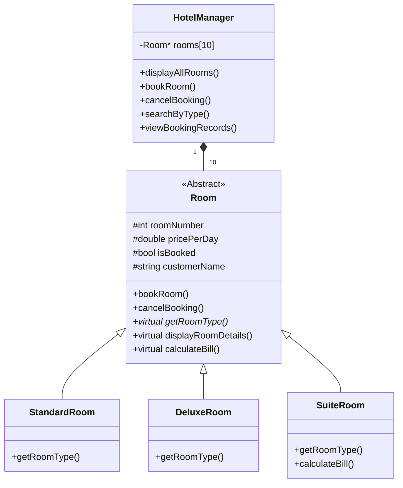
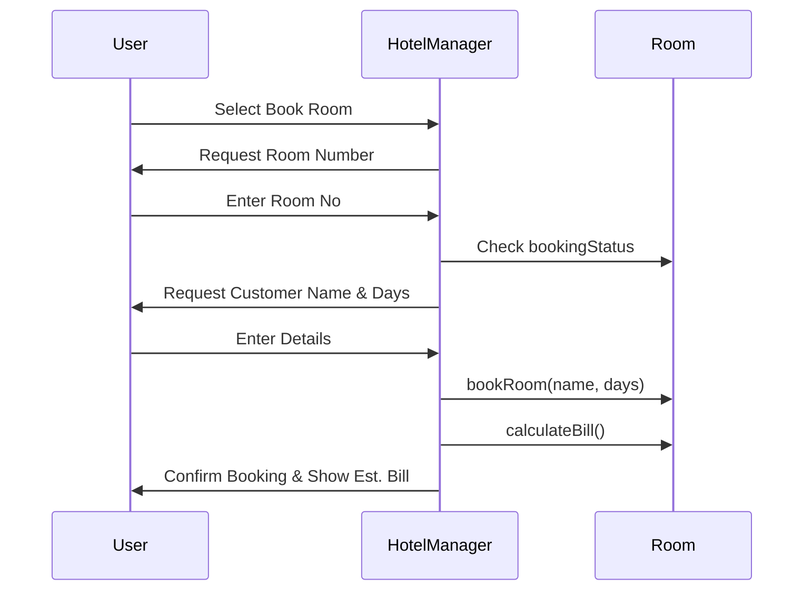

# PROJECT REPORT
## LLT–1: Application Development Using Design Concepts

**Project Title:** Elite Hotel Booking Management System  
**Course Code:** LLT–1  
**Department:** Computer Science / Application Development  
**Academic Year:** 2025-2026  

---

**Submitted By:**  
**Name:** [Your Name Here]  
**Roll No:** [Your Roll No Here]  
**Semester:** 1st Year  
**University:** [Your University Name]  

**Submitted To:**  
**Faculty Name:** [Faculty Name]  

---

\newpage

## 1. Introduction
### 1.1 Project Overview
The "Elite Hotel Booking Management System" is a console-based application written in C++. It is designed to streamline the operations of a hotel by allowing staff to manage room availability, handle customer bookings, calculate bills, and maintain records. The system leverages the power of Object-Oriented Programming (OOP) to create a modular, scalable, and easy-to-maintain codebase.

### 1.2 Objectives
*   To demonstrate core OOP principles: Encapsulation, Inheritance, Abstraction, and Polymorphism.
*   To provide a user-friendly menu-driven interface for hotel management.
*   To automate bill calculations based on different room categories (Standard, Deluxe, Suite).
*   To maintain an organized record of room statuses and customer details.

---

## 2. Application Design (OOP Principles)
This project strictly adheres to the four pillars of Object-Oriented Programming:

*   **Encapsulation:** All data members (like `roomNumber`, `price`, and `customerName`) are kept `protected` or `private`. They are accessed and modified only through public member functions (Getters/Setters), ensuring data security and integrity.
*   **Inheritance:** We used a hierarchical structure where the base class `Room` contains common properties. Specialized classes like `StandardRoom`, `DeluxeRoom`, and `SuiteRoom` inherit from it, promoting code reusability.
*   **Polymorphism:** 
    *   **Runtime Polymorphism:** Achieved using `virtual` functions. A base class pointer array (`Room* rooms[]`) stores derived class objects, and the correct `displayRoomDetails()` or `calculateBill()` function is called at runtime based on the object type.
    *   **Function Overriding:** Each derived class overrides the pure virtual function `getRoomType()` to provide its specific type name.
*   **Abstraction:** The implementation details of how rooms are stored and managed are hidden inside the `HotelManager` class. The user interacts only with high-level menu options.

---

## 3. UML Diagrams

### 3.1 Use Case Diagram
Describes the interactions between the User (Hotel Staff) and the system.

```mermaid
useCaseDiagram
    actor "Hotel Staff" as Staff
    Staff --> (Display All Rooms)
    Staff --> (Book a Room)
    Staff --> (Cancel Booking)
    Staff --> (Check Availability by Type)
    Staff --> (View Booking Records)
    Staff --> (Exit System)
```

### 3.2 Class Diagram
Shows the relationships between the classes.



### 3.3 Sequence Diagram: Room Booking
Shows the flow of operations when a user books a room.



---

## 4. Coding
The full implementation of the system is provided below. (Refer to the attached `main.cpp` for the live version).

```cpp
// [Insert code from main.cpp here]
// For the purpose of the report, the code is structured with classes:
// Room (Base), StandardRoom, DeluxeRoom, SuiteRoom (Derived), and HotelManager.
```

---

## 5. Input & Output Screen
The application uses a formatted console output. 

*   **Main Menu:** Displays 6 options indexed numerically.
*   **Room Display:** Shows a tabular view with columns for Room No, Type, Price, Status, and Customer Name.
*   **Booking Input:** Prompts for room number, guest name, and duration of stay.
*   **Bill Display:** Shows the final amount after booking, including a luxury tax logic for Suite rooms.

*(Placeholder for your Screenshots: Run the program and paste screenshots of the menu and table here)*

---

## 6. Conclusion
The Hotel Booking Management System effectively demonstrates the practical application of C++ OOP concepts. By using inheritance and polymorphism, the system remains flexible and easy to extend. The abstraction provided by the `HotelManager` class ensures that the front-end menu logic remains independent of the back-end data management. This project serves as a solid foundation for more complex application development using modern design patterns.

---

## 7. References
1.  Stroustrup, B. (2013). *The C++ Programming Language*. Addison-Wesley.
2.  Deitel, P., & Deitel, H. (2016). *C++ How to Program*. Pearson Education.
3.  Standard C++ Documentation (cppreference.com).
4.  GeeksforGeeks C++ OOP Tutorials.
